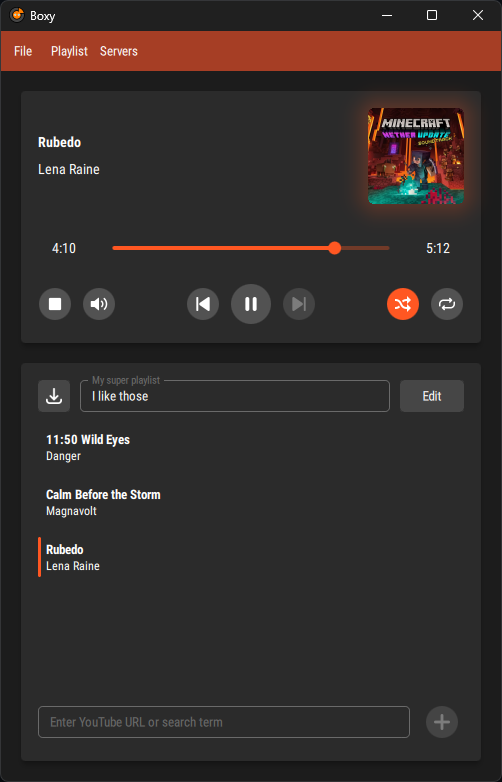

# Boxy
yt-dlp discord music bot


## Requierments

- Python 3.13
- Install dependencies: `pip install -r requirements.txt`
- ffmpeg available:
  
  Windows: Automated installation available in the setup page

  Ubuntu: `sudo apt install ffmpeg`

  Fedora: `sudo dnf in ffmpeg`

  Arch: `sudo pacman -S ffmpeg`

## Setup

### Windows

Open powershell and run:

```powershell
iex ((New-Object System.Net.WebClient).DownloadString('https://raw.githubusercontent.com/Odizinne/Boxy/refs/heads/main/boxy_setup.ps1'))
```

This command will install python3.13 and required dependencies, as well as creating a desktop shortcut.

### Linux / UNIX

from Boxy directory:

```bash
pip install -r requierments.txt
python3 boxy.py
```

## Usage 

Wait for boxy to connect.

Select server / channel where boxy should join, paste url or type search to textinput and press enter.
